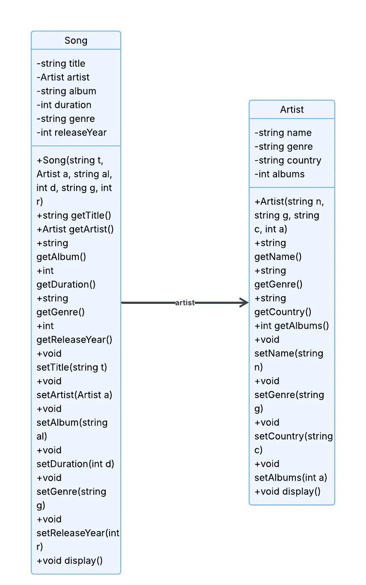
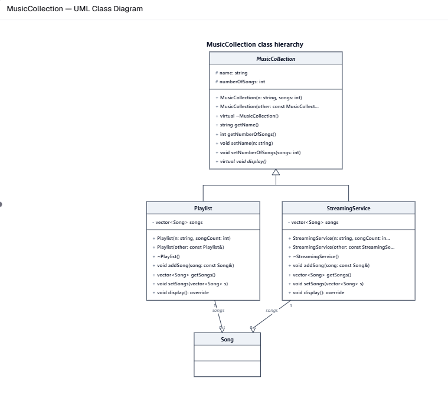

# Music Library

This program is being made into a music streaming library. It'll track songs, artists, playlists, and streaming services. The program will use inheritance and polymorphism to show how different types of music collections can be managed.

## Additional classes

- MusicCollection
- Playlist
- StreamingService

 ## Requirements

- **Inheritance:** `Playlist` and `StreamingService`  inherit from `MusicCollection` because both share a name and song count.
- **Constructor/Destructor:** Every class has both. Derived constructors call the base constructor in an initializer list. `MusicCollection` has a virtual destructor so derived objects are deleted correctly.
- **Copy Constructors:** Each class has one. Derived ones call `MusicCollection(other)` and copy their own `songs` vector.
- **Polymorphism:** `display()` is virtual and overridden in each  class, so each prints differently.
- **Access Specifiers:** `name` and `numberOfSongs` are protected so derived classes can use them. Each `songs` vector is private.
- **Friend Function:** `showCollectionInfo()` is a friend of `MusicCollection` so it can read the protected members directly.
- **Abstract Class:** `MusicCollection` is abstract because `display()` is pure virtual (`= 0`). A generic collection has nothing to display.
## UML Diagrams

### Song and Artist

### New Classes

